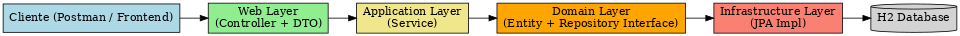

# 🎥 Sistema de Reservas de Cinema

Sistema completo para gerenciamento de reservas de cinema, com arquitetura baseada em DDD, backend em Spring Boot e frontend em Angular + Tailwind CSS.

## 🚀 Tecnologias Utilizadas

### Backend (Java + Spring Boot)
- Spring Web
- Spring Data JPA
- H2 Database (dev)
- Swagger (documentação)
- Arquitetura com DDD (Domain-Driven Design)

## 🧩 Arquitetura DDD - Visão Geral

Abaixo, o diagrama de como o fluxo DDD foi aplicado no sistema:



### Frontend (Angular)
- Angular 18
- Angular Forms + HTTPClient
- Tailwind CSS (estilização moderna)

---

## ⚙️ Funcionalidades

### 🎬 Cadastro de Filmes
- Título, descrição e duração
- Listagem automática após cadastro

### 🏢 Cadastro de Salas
- Nome e capacidade da sala

### 🕒 Cadastro de Sessões
- Seleção de filme, sala e horário
- Listagem das sessões cadastradas

### 👥 Realizar Reserva
- Selecionar sessão
- Informar nome, e-mail e assento
- Reserva é criada associando o usuário e a sessão

### 📄 Listagem de Reservas
- Visualização de todas as reservas feitas

---

## 🗂️ Organização do Projeto

### Backend
```
src/
└── main/
    └── java/
        └── com/john/cinemaapi/
            ├── domain/         # Entities, VOs e interfaces de repositórios
            ├── application/    # Regras de negócio (Services)
            ├── infra/          # Implementações dos repositórios (JPA)
            └── web/            # Controllers + DTOs
```

### Frontend
```
src/
├── app/
│   ├── core/          # Services + Models
│   ├── pages/         # home, reserva, minhas reservas, admin/filmes/salas/sessoes
│   └── components/    # navbar, toast, etc.
```

---

## ▶️ Como Executar

### Backend
```bash
cd backend
./mvnw spring-boot:run
```
Acesse o Swagger em: [http://localhost:8080/swagger-ui/index.html](http://localhost:8080/swagger-ui/index.html)

### Frontend
```bash
cd frontend
npm install
ng serve
```
Acesse em: [http://localhost:4200](http://localhost:4200)
